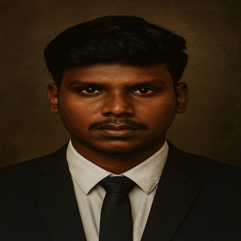

<table>
  <tr>
    <td width="25%">
      
    </td>
    <td>
      <h1>Hi 👋, I'm <b>SURYA A</b></h1>
      <h3>Electronics & Communication Engineering Student | Python & AI Enthusiast</h3>
      

        🎓 B.E. Graduate, <b>University College of Engineering, Kancheepuram</b> 
        💡 Interested in <b>Artificial Intelligence</b>, <b>Computer Vision</b>, and <b>IoT Projects</b> 
        🧪 Key Projects: Brain Tumor Detection, Autonomous Car, EEG-Controlled Home Automation, Currency Recognition 
        📫 <b>Email:</b> suryaarumugam2021@gmail.com 
        🌐 <b>Portfolio:</b> <a href="https://thunderous-cascaron-dc8b57.netlify.app/">thunderous-cascaron-dc8b57.netlify.app</a> 
        📄 <b>Download Resume:</b> <a href="Surya_Resume.pdf" download>Click here to download</a>
      

    </td>
  </tr>
</table>

---

### 🛠️ Tools & Technologies

#### 🧑‍💻 Languages & Tools

  
  
  
  
  

#### 📦 Frameworks & Libraries

  
  
  
  

---

### 📌 Featured Projects

| Project | Description | Tech Stack |
|--------|-------------|------------|
| 🔬 **Brain Tumor Detection** | Detects and classifies tumors using YOLOv12 + Dilated CNN | PyTorch, OpenCV |
| 🧠 **EEG-Controlled Home Automation** | Controls devices via brain signals using ADS1299 + ML | Raspberry Pi, Python |
| 🚗 **Self-Driving Car** | Lane detection, obstacle avoidance, self-parking | Computer Vision, Raspberry Pi, Python |
| 💸 **Currency Recognition** | AI-based currency detection system for visually impaired | OpenCV, Raspberry Pi |

---

### 📊 GitHub Stats

  
  

---

### 🌐 Connect with Me

  
  
  

---

  <b>Made with ❤️ by SURYA A</b>

